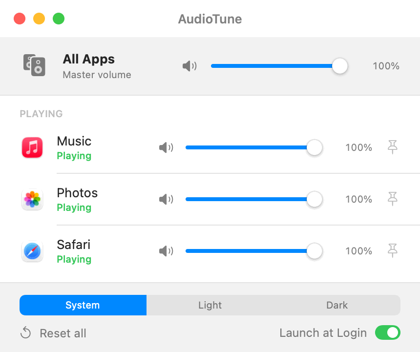

# AudioTune

Per-app volume control for macOS — a quick mixer in the menu bar, plus a full
window when you want more room. No kernel extension, no audio driver: it uses the
modern Core Audio process-tap API (macOS 14.4+) to tap each app's audio, mute its
direct output, and re-render it through a private aggregate device at an
adjustable per-app gain.

<p align="center">
  
</p>

## Features

- **Per-app volume sliders**, live as you drag — from the menu bar or the window
- **Per-app mute**
- **Master channel** — one slider/mute scaling every app
- **Pin** apps to keep them in the main menu (vs. the "All apps" submenu)
- **Stays out of the way** — lives in the menu bar only; a Dock icon appears
  just while the window is open
- **Persistent** — levels are remembered per app (by bundle id) across launches
- **Auto-attach** — a saved level re-applies the moment an app starts playing
- **Follows your output device** — rebuilds taps when you switch headphones/speakers
- **Presets** — save your mix as "Work", "Gaming", "Streaming" and switch in one
  click from the window, the menu bar, the Dock menu, or a shortcut
- **Per-device presets** — bind a preset to an output device and it applies
  itself the moment that device becomes the default. Plug in your earbuds and
  your earbud mix loads automatically; devices you haven't bound behave exactly
  as before.
- **Global keyboard shortcuts** — control audio from anywhere, fully rebindable:
  - **⌃⌥↑ / ⌃⌥↓** — raise / lower the focused app's volume (5% steps, repeats while held)
  - **⌃⌥M** — mute / unmute the focused app
  - Bind your own for the master channel, for **specific apps**, and for presets
  - A small on-screen HUD shows the change (like the system volume overlay)
- **Light / Dark / System appearance** — System follows the OS and updates live
- **Launch at Login** toggle

## Using it

AudioTune runs in the **menu bar**. Click its icon for the quick mixer: the master
slider, every app that's playing, and a **Preset** submenu.

For the full interface choose **Open Window** (⌘O) from that menu. The window has
three tabs:

| Tab | What's there |
|---|---|
| **Mixer** | Master plus every app, with slider, mute and pin |
| **Presets** | Save the current mix as a named preset; apply, rename, update or delete it, give it a shortcut, or bind it to an output device so it loads automatically |
| **Shortcuts** | Rebind the global shortcuts and assign raise/lower/mute shortcuts per app |

A shared footer — **Reset all**, appearance, **Launch at Login** — sits under all
three tabs. Closing the window leaves AudioTune running in the menu bar.

## Requirements

- macOS 14.4 or later (Apple Silicon or Intel)

## Install

### Option A — download the prebuilt app

1. Grab `AudioTune.zip` from the [latest release](../../releases/latest) and unzip it.
2. Move `AudioTune.app` to `/Applications`.
3. **First launch only:** because the app isn't notarized, macOS blocks it once.
   Either:
   - Open it, then go to **System Settings → Privacy & Security**, scroll down,
     and click **"Open Anyway"**, **or**
   - run this in Terminal to clear the download flag:
     ```sh
     xattr -dr com.apple.quarantine /Applications/AudioTune.app
     ```
4. The first time you move a volume slider, macOS asks for **audio-recording**
   permission — click **Allow** (this is what lets AudioTune tap app audio).

> Why the warning? AudioTune is open-source and ad-hoc signed, not notarized
> through Apple's paid program. The warning is about *distribution*, not safety —
> the code is all in this repo. It works identically once past the first launch.

### Option B — build from source (no Gatekeeper prompt)

Needs the Swift toolchain (Xcode or Command Line Tools). Locally-built apps
aren't quarantined, so there's no warning:

```sh
git clone https://github.com/ZechariahJ/audiotune.git
cd audiotune
./build.sh            # -> AudioTune.app (ad-hoc signed, local use)
open AudioTune.app
```

## Permissions

AudioTune needs **audio-recording** permission to tap other apps' audio. The
first time you move a volume slider, macOS shows the prompt — click **Allow**.

This is a **one-time grant**, not per-launch. macOS remembers it across every
future open, and you can review or revoke it under **System Settings → Privacy &
Security → Microphone** (audio capture is grouped under "Microphone").

You may be asked to approve again if you **install a new version** (a different
build has a different signature) or **build from source repeatedly** — each build
looks slightly "new" to macOS. Normal day-to-day use never re-prompts.

## Layout

**Audio engine**

| File | Role |
|---|---|
| `ProcessTap.swift` | Tap + aggregate device + realtime gain render callback |
| `AudioProcessMonitor.swift` | Enumerates Core Audio process objects → app roster |
| `CoreAudioHW.swift` | Default output device helpers |
| `AudioMixer.swift` | Shared state: app roster, levels, presets, hotkey dispatch |

**Interface**

| File | Role |
|---|---|
| `main.swift` | Entry point; starts as a menu-bar-only (accessory) app |
| `AppDelegate.swift` | Menus, window lifecycle, hotkey registration, device listener |
| `MainWindowView.swift` | Window tabs: Mixer / Presets / Shortcuts |
| `MixerView.swift` | Mixer tab |
| `ProfilesView.swift` | Create, apply, rename and delete presets |
| `ShortcutsView.swift` | Rebind global and per-app shortcuts |
| `WindowFooter.swift` | Shared footer: reset, appearance, launch at login |
| `AppVolumeRowView.swift` | A menu row: icon, name, slider, mute, pin |
| `KeyRecorder.swift` | Click-to-record shortcut field |
| `VolumeHUD.swift` | On-screen overlay shown when a shortcut changes volume |

**Supporting**

| File | Role |
|---|---|
| `GlobalHotKeys.swift` | System-wide hotkeys (Carbon), with hold-to-repeat |
| `Profiles.swift` | Preset + hotkey models |
| `SettingsStore.swift` | Persisted levels, presets and shortcuts (UserDefaults) |
| `LoginItem.swift` | Launch-at-login via SMAppService |
| `Log.swift` | Size-capped diagnostic log in `~/Library/Logs/AudioTune` |

## Privacy

AudioTune makes **no network requests** — no telemetry, no analytics, no
auto-update — and asks for exactly one permission (audio recording, required by
the tap API). Tapped audio is never written to disk. See
[SECURITY.md](SECURITY.md) for details and how to report a vulnerability.
